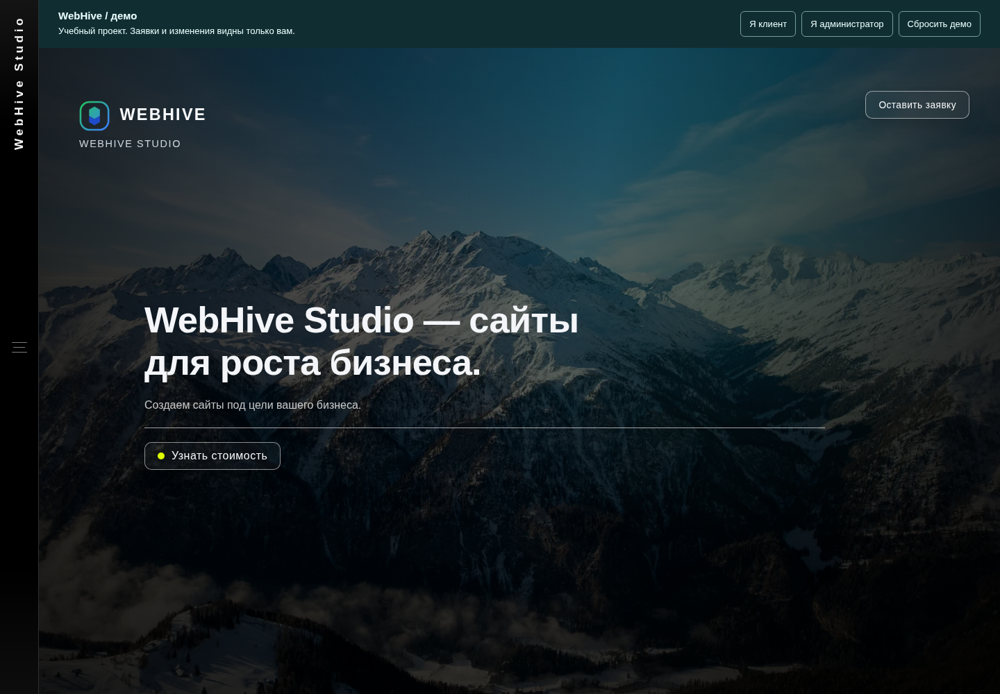
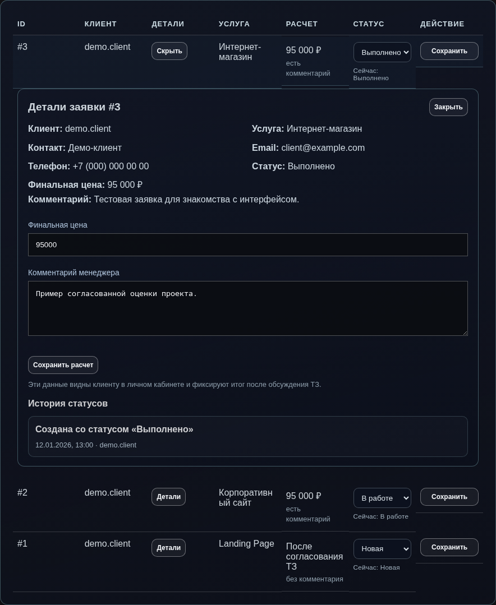

# WebHive Studio

Веб-приложение для работы с заявками небольшой студии: каталог услуг → заявка клиента → оценка менеджера → история статусов. Учебный full-stack проект на **Vanilla JavaScript, Express и PostgreSQL**.

[Посмотреть код](https://github.com/lixo283/WebHive) · [Как опубликовать демо](docs/deployment.md) · [Схема БД](docs/database.md)



## Что можно попробовать

- Найти услугу по названию, категории и диапазону цены.
- Открыть кабинет клиента, создать заявку и посмотреть историю статусов.
- Переключиться в администратора, согласовать стоимость и оставить комментарий.
- Добавить, изменить или удалить услугу и кейс портфолио.
- Вернуться к клиенту и увидеть обновлённую оценку.

**Это демонстрационный проект.** Кейсы, отзывы, контакты и цены — примеры наполнения интерфейса. Они не подтверждают коммерческий опыт автора. Демо не отправляет заявки реальной студии и не принимает оплату.

## Быстрый запуск без базы данных

Нужен Node.js 22+ и npm. Команды выполняются из корня репозитория:

```bash
npm ci --prefix backend
./up.sh
```

Откройте [localhost:3000](http://localhost:3000). В панели сверху доступны **«Я клиент»**, **«Я администратор»**, **«Сбросить демо»**. Пароли и регистрация не нужны. В начальном состоянии — девять услуг, четыре кейса и три заявки.

Изменения сохраняются в `localStorage` только текущего браузера. Контакты заявки заполнены тестовыми значениями. Не вводите личные данные в комментарии. Сброс удаляет только данные WebHive, оставляя данные других сайтов и приложений нетронутыми.

## Два режима

| | Демо | Live |
| --- | --- | --- |
| Запуск | `./up.sh` | `./up.sh live` |
| Данные | Локальные примеры + `localStorage` | PostgreSQL через Express API |
| Авторизация | Переключение демонстрационных ролей | Регистрация, bcrypt, JWT |
| Хранение изменений | В браузере посетителя | В общей БД |
| Хостинг | GitHub Pages или другой статический хостинг | Node.js-сервис + PostgreSQL |
| Зависимость от доступности БД | Нет | Есть |

Live **не переключается в демо при ошибке**. Режим задаётся явно сервером или сборкой. JWT live-сессии и состояние демо хранятся под разными ключами. Демо-роли не дают доступа к live API.

## Сценарий просмотра за две минуты

1. Нажмите «Я клиент»: кабинет показывает примеры заявок.
2. Откройте каталог через меню, выберите услугу и отправьте тестовую заявку.
3. Нажмите «Я администратор». В разделе заявок откройте «Детали» нужной записи.
4. Выберите статус «В работе», укажите финальную цену и комментарий, сохраните расчёт.
5. Вернитесь в роль клиента: оценка и история доступны в кабинете, в том числе после перезагрузки.



<details>
<summary>Мобильная версия</summary>


</details>

## Стек и устройство

| Слой | Решение |
| --- | --- |
| Интерфейс | 12 HTML-страниц, CSS, Vanilla JavaScript, Fetch API |
| Сервер | Node.js, Express 4, REST API |
| База | PostgreSQL, драйвер `pg`, параметризованные запросы |
| Авторизация | bcrypt-хеши, JWT HS256 со сроком действия два часа |
| Проверки | `node:test`, Playwright, отдельная PostgreSQL для интеграционных тестов |
| Публикация | Статическая сборка демо, GitHub Actions |

```text
frontend/               HTML, стили, изображения и браузерная логика
  assets/js/main.js     интерфейс и запросы live API
  assets/js/demo.js     независимое хранилище и сценарии демо
  assets/js/config.js   явный режим; по умолчанию live
backend/
  app.js                Express, заголовки, маршруты и обработка ошибок
  server.js             запуск сервера и корректное завершение
  controllers/          валидация, SQL и бизнес-операции
  middleware/auth.js    проверка JWT и актуальной роли в БД
  scripts/              применение схемы и назначение администратора
  .env.example          пример конфигурации без рабочих секретов
database/               схема и публичные примеры услуг/кейсов
scripts/                проверка исходников, сборка и просмотр демо
tests/                  API, демо-хранилище и браузерные сценарии
docs/                   инструкции, схема БД, скриншоты
.github/workflows/      проверки и ручная публикация GitHub Pages
up.sh                   единая точка локального запуска
```

### Как проходит заявка в live

Express проверяет JWT, загружает актуальную роль пользователя, валидирует услугу и контакты. Заявка и первая запись истории создаются в одной транзакции. Администратор меняет статус и оценку в другой транзакции с `SELECT … FOR UPDATE`: параллельные изменения одной заявки не создают противоречивую историю.

Клиент получает только собственные заявки. Просмотр чужой истории запрещён. Удаление услуги, на которую существуют заявки, возвращает конфликт. Базовая цена услуги и согласованная `final_price` заявки хранятся отдельно.

### Поведение интерфейса

- Поиск отправляет запрос через 250 мс после ввода; запоздавший ответ не заменяет свежий результат.
- Запросы завершаются ошибкой после 12 секунд ожидания; каталог предлагает повторить загрузку.
- Ошибка записи не маскируется успешным уведомлением. Запись автоматически не повторяется.
- Видеофон включается кнопкой и не скачивается автоматически. Есть поддержка `prefers-reduced-motion`.
- Закрытое меню исключено из клавиатурной навигации; Escape закрывает меню и возвращает фокус.

## Запуск с PostgreSQL

Нужны PostgreSQL и клиент `psql`. Создайте отдельную пустую БД, доступную вашему пользователю PostgreSQL, например:

```bash
createdb webhive
cp backend/.env.example backend/.env
node -e "console.log(require('node:crypto').randomBytes(32).toString('hex'))"
```

В `backend/.env` укажите `DATABASE_URL` вашей БД и сгенерированный `JWT_SECRET`. Шаблон содержит только локальные примеры; его значения нужно заменить. Затем:

```bash
npm --prefix backend run db:setup
./up.sh live
```

`db:setup` явно применяет схему и добавляет отсутствующие примеры услуг/кейсов. Он не создаёт аккаунты, не назначает роли и не меняет пароли. Обычный старт приложения не меняет схему и не запускает seed.

Зарегистрируйте собственный аккаунт в интерфейсе. Для назначения администратора владельцем сервера:

```bash
npm --prefix backend run admin:promote -- your_login
```

Замените `your_login` своим логином и войдите заново. Публичных административных паролей в текущей версии нет.

## API

Все пути начинаются с `/api`. Авторизованные запросы передают `Authorization: Bearer <token>`.

| Метод | Путь | Доступ |
| --- | --- | --- |
| GET | `/health` | Проверка процесса, без обращения к БД |
| GET | `/ready` | Проверка БД и наличия таблицы заявок, только live |
| POST | `/auth/register`, `/auth/login` | Гость; до 30 попыток с IP за 15 минут |
| POST | `/auth/logout` | Совместимый endpoint, сам JWT не отзывает |
| GET | `/services`, `/services/:id`, `/portfolio` | Гость |
| POST | `/services`, `/portfolio` | Администратор |
| PUT, DELETE | `/services/:id`, `/portfolio/:id` | Администратор |
| POST | `/applications` | Авторизованный пользователь |
| GET | `/applications` | Клиент: свои; администратор: все |
| GET | `/applications/:id/history` | Владелец заявки или администратор |
| PATCH | `/applications/:id/status` | Администратор |

Фильтры услуг: `search`, `category`, `minPrice`, `maxPrice`. Фильтр заявок: `status=new|work|done`. Некорректный ввод возвращает 400, отсутствие авторизации — 401, запрет доступа — 403, конфликт связанных записей — 409, временная недоступность БД — 503.

## Проверки

```bash
npm --prefix backend run check
npm --prefix backend test
npm --prefix backend exec -- playwright install chromium
npm --prefix backend run test:browser
npm audit --prefix backend --omit=dev
npm --prefix backend run build:demo
```

`check` проверяет синтаксис JS и отсутствие отслеживаемых `.env`, зависимостей и SQL-сессий. Unit/API-тесты проверяют JWT, права, ошибки соединения, ограничение попыток входа, сохранение демо и сброс. Для полного live-сценария задайте `TEST_DATABASE_URL` **отдельной тестовой БД** с применённой схемой; без него один интеграционный тест явно пропускается. CI поднимает такую БД автоматически.

Playwright проверяет клиентскую заявку → оценку администратора → кабинет, фильтры, восстановление состояния и мобильную навигацию. Демо тестируется под `/WebHive/`, как на GitHub Pages, с проверкой отсутствия API-запросов. Можно использовать системный Chromium через переменную `PLAYWRIGHT_CHROMIUM_EXECUTABLE`.

## Публикация

`npm --prefix backend run build:demo` создаёт `dist/` только с браузерными файлами. Backend, SQL, документация, `.env`, исходные тяжёлые изображения и зависимости в сборку не попадают.

Публикация настроена отдельным ручным workflow **Publish portfolio demo**. Она не запускается от обычного push. Порядок включения GitHub Pages и настройки live-сервера описаны в [инструкции](docs/deployment.md).

## Ограничения и следующие шаги

- Это портфолио, не готовая коммерческая CRM: нет оплаты, почты, восстановления пароля и загрузки файлов.
- JWT live хранится в `localStorage`. Выход удаляет локальную сессию, но украденный токен действует до истечения срока; для коммерческого использования нужны серверные сессии/отзыв и пересмотр хранения токенов.
- Rate limiting хранится в памяти одного процесса. Для нескольких экземпляров нужен общий store и проверенная настройка reverse proxy.
- Заявки не имеют idempotency key: после сетевого тайм-аута сначала проверьте кабинет, прежде чем отправлять повторно.
- Каталог и списки заявок без серверной пагинации, рассчитаны на небольшой учебный набор данных.
- Демо не является защитой данных: роли можно переключать, изменения локальны. Лимиты: 50 заявок и по 100 услуг/кейсов.
- Live зависит от отдельной PostgreSQL и хостинга. Статическое демо от них не зависит.
- Медиа сохранены из учебного проекта. Их происхождение и права использования не подтверждены в репозитории; перед коммерческим использованием нужны собственные или лицензированные материалы.
